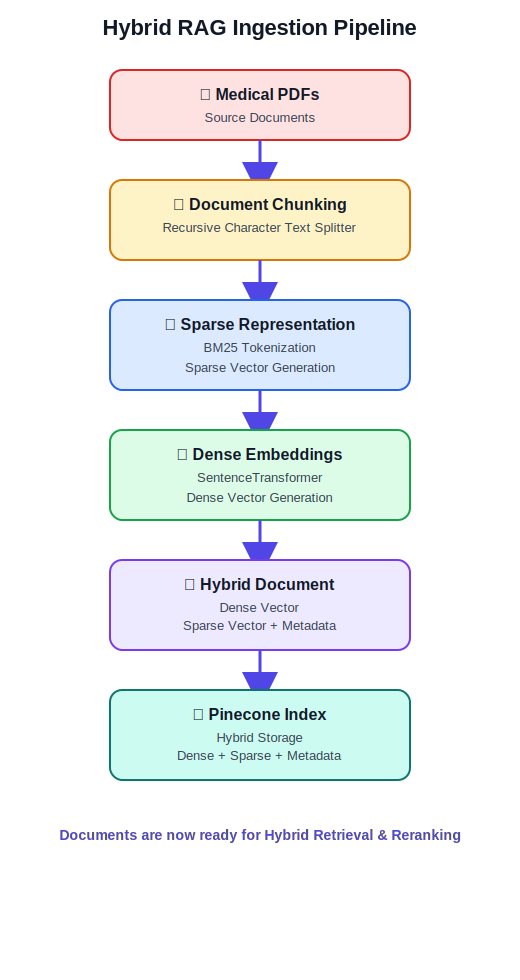

# IT Support RAG Agent

A Retrieval-Augmented Generation (RAG) agent for IT support, built with Python and Qdrant.

## Setup

First, activate the virtual environment:

**Windows (PowerShell):**
```powershell
.\it-support\Scripts\Activate.ps1
```

**Windows (Command Prompt):**
```cmd
.\it-support\Scripts\activate.bat
```

## Pipeline



The system consists of a two-step pipeline:

### 1. Ingestion
Run the ingestion script to process your markdown documentation, split it into chunks, embed it, and store it in the Qdrant vector database.

```powershell
python .\ingest.py
```

### 2. Retrieval
Run the retrieval script to perform hybrid searches (BM25 + Dense embeddings) with Reciprocal Rank Fusion (RRF) against the ingested chunks.

```powershell
python .\retrieve.py
```
*Note: The retrieval script will wait for standard input when it runs. Type your query and press Enter to search the database.*
